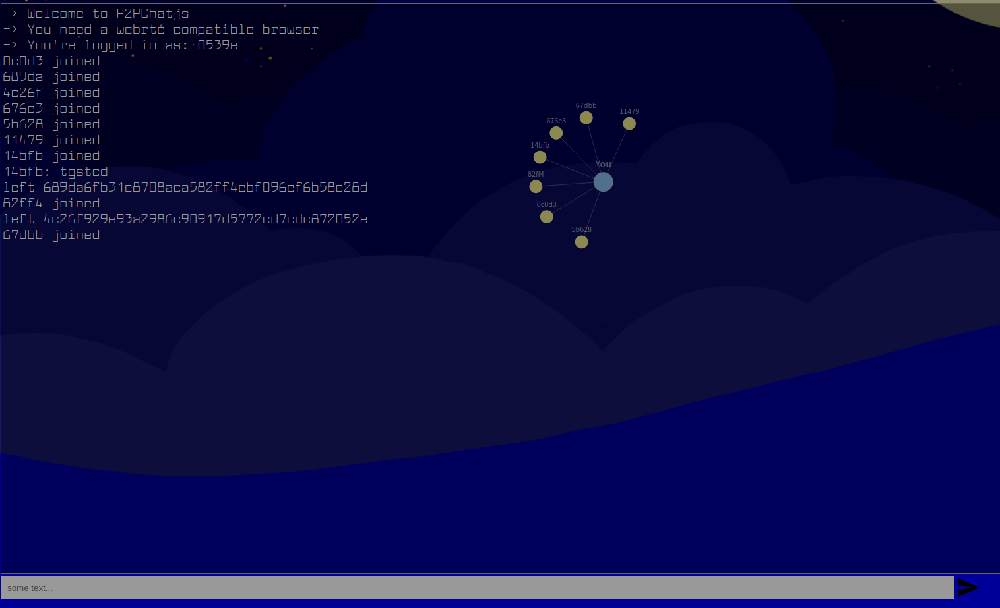

# P2PChatjs

A simple P2P Chat for Javascript (Browser and NodeJS)

## Usage

Clone and navigate to index.html or at 

http://irc.thecout.com/p2pchat/

## Styles

comes with two style.css and style02.css

## Dependencies

- Dreamtime
    - Webtorrent
    - webrtc
- p2p-graph

## Screenshot

